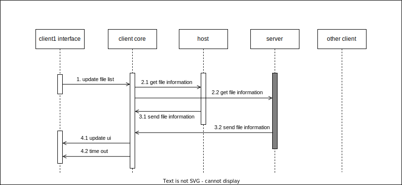

# Detail Design

## Sequence of Some Cases

**use case2**



**use case4**


## Protocol Design

Token's json string:

- when use to identify right:
  
  ```json
  {
      "id": string,
      "password": string
  }
  ```

- when only use to show tokens:
  
  ```json
  {
      "id": string,
      "password": ""
  }
  ```

User's json string:

- Local user

  ```json
  {
      "type": "LAN",
      "hostname": string,
      "ip": string
  }
  ```

- Server user
  
  ```json
  {
      "type": "SERVER",
      "uid": string,
      "name": string
  }
  ```

FileInfo's json string:

```json
{
    "path": string,
    "time": string,
    "size": int,
    "tokens": array of json string of Token,
    "user": json string of User
}
```

### protocols between user interface and client core

Format: `Type Action [Args ...]\0` (case sentensive)

1. register user

   send:  `CMD register name password`

   reply: json string

   ```json
   {
       "statu": int,
       "uid": string,
       "name": string,
       "msg": string
   }
   ```

2. login

   send: `CMD login (name|uid) password`

   reply: json string

   ```json
   {
       "statu": int,
       "uid": string,
       "name": string,
       "msg": string
   }
   ```

3. update file list(get file information)

   send: `CMD update-file-info`

   reply: json string

   ```json
   {
       "statu": int,
       "info": array of FileInfo,
       "msg": string
   }
   ```

4. list files

   send: `CMD list (all | my | server | hosts)`

   reply: json string

   ```json
   {
       "statu": int,
       "info": array of FileInfo,
       "msg": string
   }
   ```

5. download file

   send: `CMD download filename` (filename should be the releative path shown in FileInfo)

   reply: json string

   ```json
   {
       "statu": int,
       "msg": string
   }
   ```

   - query download process

     send: `CMD download-query filename`

     reply: json string

     ```json
     {
        "statu": int,
        "process": int,
        "msg": string
     }
     ```

6. upload file or information

   send: `CMD upload [-info] filename` (if add `-info`, will only upload the FileInfo)

   reply: json string

   ```json
   {
       "statu": int,
       "msg": string
   }
   ```

   - query upload process

     send: `CMD upload-query filename`

     reply: json string

     ```json
     {
        "statu": int,
        "process": int,
        "msg": string
     }
     ```

7. make file unshared

   send: `CMD unshare [-d] filename` (if add `-d`, will delete the file on server)

   reply: json string

   ```json
   {
       "statu": int,
       "msg": string
   }
   ```

8. make file shared

   send: `CMD share filename` (filename should be the absoulte path)

   reply: json string

   ```json
   {
       "statu": int,
       "msg": string
   }
   ```

9. create token
    
   send: `CMD token -c [-s [-u user]] identifier password` (`-s` for creating server token, and `-u` to specified the user)

   **Notice**: the `user` shouldn't be the user self, and when specified the `user`, the token is only saved on host, which is sent to server only when try to download file.

   reply: json string

   ```json
   {
       "statu": int,
       "msg": string
   }
   ```

10. destroy token
    
    send: `CMD token -d identifier`

    reply: json string

    ```json
    {
        "statu": int,
        "msg": string
    }
    ```

11. apply token
    
    send: `CMD token -a token_identifier filename`

    reply: json string

    ```json
    {
        "statu": int,
        "msg": string
    }
    ```

12. remove token from file
    
    send: `CMD token -r token_identifier filename`

    reply: json string

    ```json
    {
        "statu": int,
        "msg": string
    }
    ```

### protocols between different hosts

1. get file information (udp broadcasting)
   
   send: json string

   ```json
   {
       "type": "query_area",
       "stamp": int
   }
   ```

   reply: json string

   ```json
   {
       "type": "reply_area",
       "stamp": int,
       "restMsg": int,
       "info": array of FileInfo
   }
   ```

2. download file (tcp)
   
   send: json string

   ```json
   {
       "type": "request_area",
       "filename": string,
       "tokens": array of token
   }
   ```

   reply: byte stream

   ```c
   struct AFSMsgSendArea {
       char AFSMsgType m_msgType;   // "send_area"
       char m_fileAttrib[];         // FileInfo
       char m_filedata[];           // file data
   }
   ```

### protocols between server and host

1. register (tcp)

   send: json string

   ```json
   {
       "type": "register",
       "name": string,
       "password": string
   }
   ```

   reply: json string

   ```json
   {
       "type": "register_re",
       "statu": int,
       "uid": string,
       "msg": string
   }
   ```

2. login (tcp)
   
   send: json string

   ```json
   {
       "type": "login",
       "name": string,          // also can be uid here
       "password": string
   }
   ```

   reply: json string

   ```json
   {
       "type": "login_re",
       "statu": int,
       "uuid": string,
       "cookie": string,
       "msg": string
   }
   ```

3. server request query (udp)
   
   send: json string

   ```json
   {
       "type": "query_server",
       "stamp": int,
       "cookie": string
   }
   ```

   reply: json string

   ```json
   {
       "type": "reply_query",
       "stamp": int,
       "request_type": string,      // unused now
       "request_id": int,
       "info": array of Fileinfo
   }
   ```

4. downlaod file from server (tcp)
   
   send: json string

   ```json
   {
       "type": "request_server",
       "cookie": string,
       "filename": string,
       "tokens": array of token
   }
   ```

   reply: byte stream

   ```c
   struct MsgSendServer {
       char AFSMsgType m_msgType;
       char m_fileAttrib[];
       char m_data[];
   };
   ```

5. upload file to server (tcp)
   
   send: byte stream

   ```c
   struct MsgUpload {
        char AFSMsgType m_msgType;
        char requestId[];
        char cookie[];
        char m_fileAttrib[];
        char m_data[];
   };
   ```

   reply: None

6. get file information (tcp)
   
   send: json string

   ```json
   {
       "type": "query_server",
       "cookie": string
   }
   ```

   reply: json string

   ```json
   {
       "type": "reply_server",
       "info": array of FileInfo
   }
   ```

7. create server token (tcp)
   
   send: json string

   ```json
   {
       "type": "create_token",
       "cookie": string,
       "id": string,
       "password": password
   }
   ```

   reply: json string

   ```json
   {
       "type": "create_token_reply",
       "statu": int,
       "msg": string
   }
   ```

8. destroy server token (tcp)

   send: json string

   ```json
   {
       "type": "destroy token",
       "cookie": string,
       "id": string
   }
   ```

   reply: json string

   ```json
   {
       "type": "destroy_token_reply",
       "statu": int,
       "msg": string
   }
   ```

9. apply server token

   send: json string

   ```json
   {
       "type": "apply_token",
       "cookie": string,
       "id": string,
       "filename": string
   }
   ```

   reply: json string

   ```json
   {
       "type": "apply_token_reply",
       "statu": int,
       "msg": string
   }
   ```

10. remove token from file

    ```json
    {
        "type": "remove_token_from_file",
        "cookie": string,
        "id": string,
        "filename": string
    }
    ```

    reply: json string

    ```json
    {
        "type": "remove_token_reply",
        "statu": int,
        "msg": string
    }
    ```

## Data Structure Design

**Notice**: Don't use in code, but to describe the components.

**Token**

A token contains two components: identifier and password. And there is a type field (server or LAN).

```c++
struct Token {
    enum TokenType m_type;
    std::string m_identifier;
    std::string m_password;
};
```

**FileInfo**

For FileInfo, the struct describes the file's relative and tokens, last update time and so on.

the last update time is FileInfo is different with the last modified time in file system, if you download a file from LAN, the last update time in FileInfo shouldn't be changed, but the last modified time of the file may be the time when you download the file.

```c++
struct FileInfo {
    std::string m_path;     // relative path of the shared_path in configure    
    std::string m_time;     // last update time
    std::string m_size;     // size of the file
    std::vector<Token> tokens;
    User user;
};
```

**User**

A user may only use the software in LAN, who will not register on server, we should distinguish different hosts in LAN, a possible method is to record the ip, or, we also can show the host name.

```c++
struct UserLAN {
    std::string m_hostName;
    uint32_t ip;
};
```

```c++
struct User {
    std::string uuid;
    std::string name;
};
```

## Directory Structure Design

1. client/host

   - shared_path
     - file1
     - file2
     - dir1
       - file3
       - file4
     - dir2
     - ...
     - .info_dir
       - file1_info.json
       - file2_info.json
       - dir1
         - file3_info.json
         - file4_info.json
       - dir2
       - ...
   
   - download_path
     - file1
     - file2
     - ...

   - token_path
     - token1_id.json
     - token2_id.json
     - ...

2. server
   
   - file_save_path
     - uid1
       - file1
       - dir1
         - file2
       - dir2
       - ...
       - .info_dir
         - file1_info.json
         - dir1
           - file2_info.json
         - dir2
         - ...
     - uid2
     - uid3
     - ...

## Database Design

For MySQL


For Redis

| key               | value          |
| ----------------- | -------------- |
| cookie            | `{uid: xxxx}`  |
| uid+token_id      | token_password |
| server_request_id | server_request |

## Configures

`Area Files` uses json to config the software, all possible option are bellow:

configure for client/host

```json
{
    "download_path": string,
    "shared_path": string,
    "token_path": string,
    "server_ip": string,
    "server_port": int,
    "host_ip": string,
    "host_port": int,
    "broadcast_ip": string,
    "client_listen_ip": string,
    "client_listen_port": int,
    "localhost_name": string
}
```

configure for server

```json
{
    "server_ip": string,
    "server_port": int,
    "file_save_path": string,
    "mysql_ip": string,
    "mysql_port": int,
    "redis_ip": string,
    "redis_port": int
}
```

## UML


