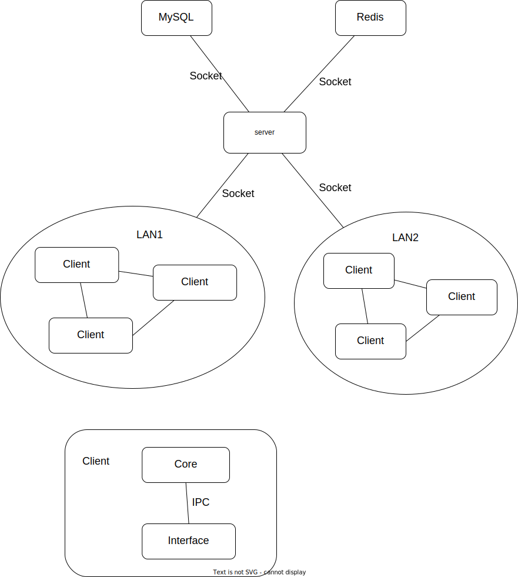

# Initiation Report

**Members**:
[ChenCgj](https://github.com/ChenCgj),
[BarackCheung](https://github.com/BarackCheung),
[cwyLeo](https://github.com/cwyLeo),
[RS2002](https://github.com/RS2002)

## Introduction to **Area Files**

There are a lot of eletronic devices with storage in our life, such as PC, mobile phone, watch, TV and so on, and sometimes we may need data on machine A when working on machine A. In this case, we can use the potable storage, for example, USB flash disk, to transmit the data between machine A and B.

However, it's known that almost all terminals are connected to the network. So why not use the network to manage and transmit the data between different devices?

The `Area Files` is a file sharing system. Users can use this system to exchange any file between different hosts. This software hides the details of different devices, so it's seem that all data are in only one seperate devices and any change on the filesystem will be seen in other devices.

Althought it is designed to work in Local Area Network, it also can share files between two hosts in different Local Area Network or Wide Area Network by using the transit server.

### Functions

1. Users can get the information of shared files in the LAN
2. Users can download files in the LAN
3. Users can share some files in the local area network
4. Users can register on the server so that they can access the server resource
5. Users can get the information of files in the transit server
6. Users can download files from the transit server
7. Users can upload some files to the transit server
8. Users can manage the files they shares, decide who can access them by creating/applying tokens for files

### Vision

1. Easy to access data in different devices connected to the network
2. Easy to manage the shared data in different devices
3. Easy to share files in the different LAN or users

### Target Customers

1. Anyone who has the some electronic storage devices and want to share data between them
2. Anyone who want to share files to others or browse other people's shared media file for fun

## Project Management

- **Software Process**: Agile

  Althought all team members don't have the similar experimence to develop such a software, but we decide to use Agile for:

  - possibly add/remove requirements/function in development
  - possibly modify some protocol in development
  - can't exactly describe how the software wokes before we try to use it
  - we want to have a usable software as quick as possible and then imporve it

- **Manage Tool**: GitHub Project
- **Code Manage**: git tools and GitHub platform
- **Schedule**:

  start on **2023.05.01**
  - week1: requirements analyze, technical scheme decision, architecture design, database design, protocol design
  - week2: prototype development
  - week3 ~ week7: server development, client development, frontend develop, integration
  - week8: debug and test, maintenance

## Possible Technical Scheme

- server: c/cpp/rust/go/...
- server cache: Redis
- server files storage: disks on server
- server deploy: Docker
- database: MySQL/PostgreSQL
- client interface: CLI/Web/...

## Risk and Feasibility Analysis

Risk:

1. team member are pressed for time
2. team member have to use some technology which they are not familiar to
3. the most complex part of the software is the design which determines the quality of the software

Feasibility:

1. there is some similar software to reference
2. the core part only need knowledge we have studied
3. can develop the mini version of the software firstly and then improve it

## Quality Assurance

1. Code Review: members review code for each other
2. Test: fully test for each module
3. Maintenance: fix bugs and maintenance the server

## Possible Architecture

